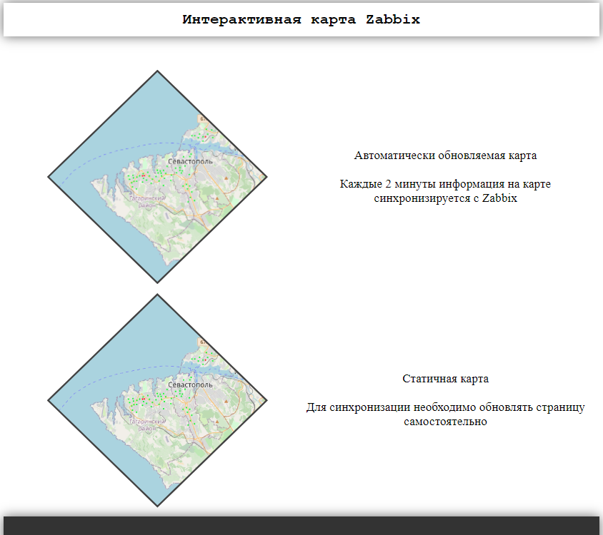
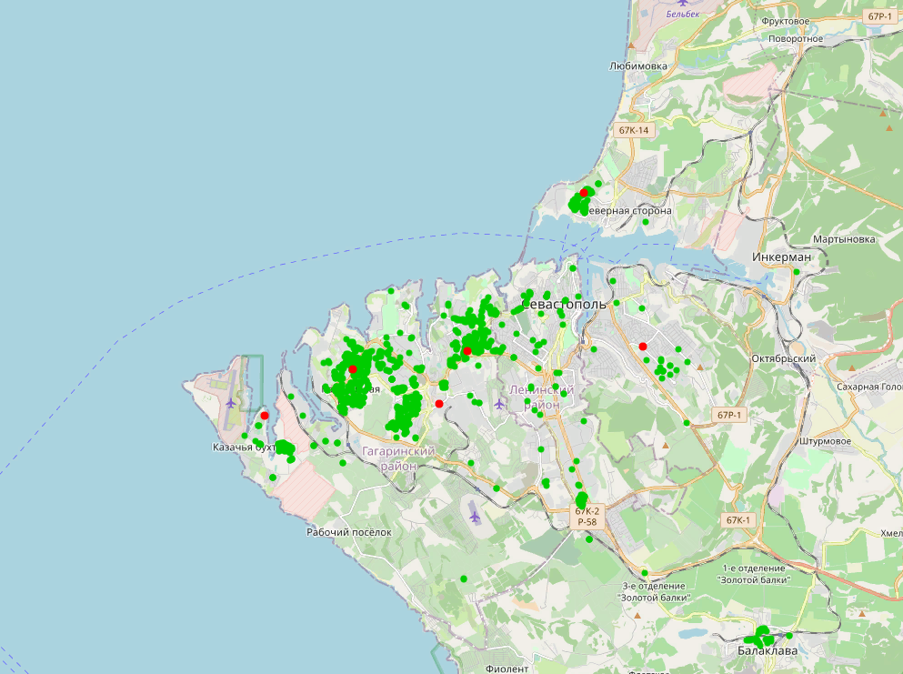
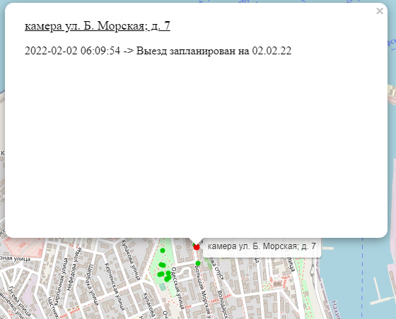

# Интерактивная карта Zabbix

---

При нажатии на узел на карте открывается всплывающее окно

Если повторно нажать на название узла, откроется новое окно 
данного оборудования в Zabbix

Также здесь отображаются сообщения подтверждения данной проблемы

Для отображения оборудования на карте, необходимо прописать широту и долготу в соответствующих полях во вкладке "Инвентаризация"

Отображает на карте состояние оборудования используя триггер Zabbix с именем 
"Оборудование недоступно"

Если триггер сработал, то узел окрашивается в красный цвет

Для синхронизации с сервером Zabbix используются два скрипта

1. `get_data.py` - создает файлы с координатами оборудования
2. `zabbix-api.py` - проверяет оборудование из ранее созданных файлов 
с координатами и окрашивает узлы в зависимости от сработки триггера
"Оборудование недоступно"

### Подготовка к запуску
Первым делом необходимо в файле `conf` указать данные авторизации 
для Zabbix сервера

Затем запустить скрипт `get_data.py` и в качестве параметров передать
имена групп узлов сети Zabbix. 

Например:

    $ python3 ./get_data.py Группа1 Группа2 "Группа 3"

Таким образом в папке `locations` появятся соответствующие файлы:

    Группа1.csv
    Группа2.csv
    Группа 3.csv

В каждом файле находятся имена узлов сети, их координаты 
и hostid из конкретной группы

Затем необходимо создать запись в `crontab` для периодического запуска
скрипта zabbix-api.py (без параметров)

Данный скрипт создает файл `templates/zabbix-map.html`, который 
используется в веб-интерфейсе программы

### Запуск веб-сервера
Запустить веб-сервер можно используя файл `docker-compose.yaml`, находясь
в корневой папке репозитория:

    $ docker-compose up -d

В данном файле можно указать логин и пароль суперпользователя (по умолчанию 
root/password) от
Django, а также порт для подключения (по умолчанию 8000)
